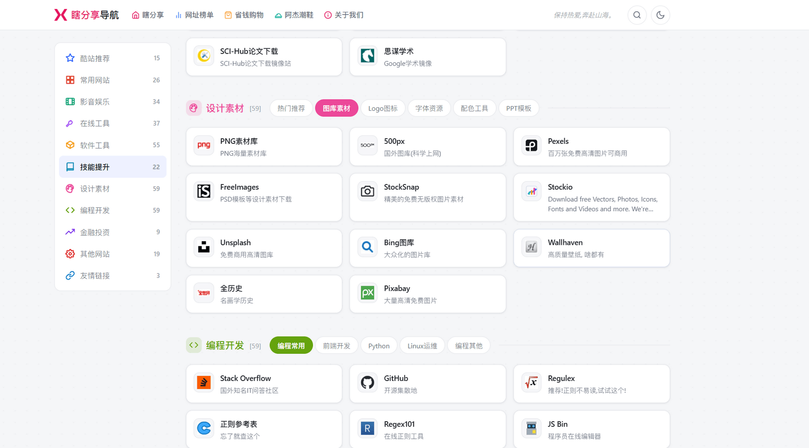
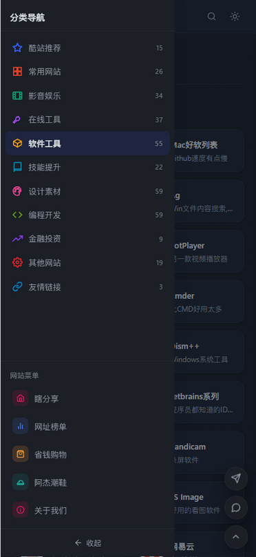

# 瞎分享导航

一个简约、纯静态的**网址导航**站 / 网址导航模板(Site Nav Template),
收录常用网站、在线工具、软件资源、设计素材、编程开发、金融投资等分类
网址。没有后端、没有数据库、没有构建工具——只有 HTML + CSS + 原生
JavaScript,克隆下来就是一份完整、可以直接用的导航站源码。

## 🔗 在线演示 Demo

**https://nav.xiafenxiang.com**

这是本项目的一个部署示例,站长本人在实际使用;如果你想要一份完全属于
自己的导航站,可以直接照着下面"如何使用"里的步骤,用这份代码自己搭
一个。

## 📸 截图

## 📸 截图

### 桌面端

<p align="center">
  
</p>

<p align="center">
  
</p>

### 深色模式

<p align="center">
  
</p>

### 移动端

<p align="center">
  
</p>

<p align="center">
  
</p>

<p align="center">
  
</p>

---

---

## 功能

- **分类网址导航**:酷站推荐、常用网站、影音娱乐、在线工具、软件工具、
  技能提升、设计素材、编程开发、金融投资、其他网站、友情链接等分类,
  每个分类下还有子分类标签方便快速筛选。
- **网址热度榜单**:独立的榜单页面(日榜/周榜/月榜)。
- **站内搜索 + 一键切换搜索引擎**:支持站内搜索,也可以直接切换到
  百度 / Google / 必应 / 淘宝搜索;搜索框有独立的浅色占位文字,不抢视觉
  重心。
- **深色模式**:一键切换浅色/深色主题,选择会记住,下次打开自动生效;
  图标、Logo 等视觉元素在深色模式下也做了专门适配,不会有生硬的白边。
- **响应式布局**:手机、平板、桌面端都做了适配。移动端有单独的抽屉式
  菜单(汉堡按钮在最左边,点击展开带遮罩的侧边抽屉,图标会在汉堡/关闭
  之间切换),底部的分类快捷入口每一项都配了彩色小图标,一眼能区分。
- **统一的本地图标库**:收录站内 260+ 个常用网站,预先抓取、裁切、
  统一尺寸后存成本地图标(`assets/icons/`),首屏不用等第三方接口
  实时抓取,视觉上也更整齐统一。找不到本地图标的网址,再按
  "网站自身 favicon → 第三方图标接口 → 文字首字母"三级顺序自动兜底,
  全站不会出现裂图。
- **随机顶部标语**:每次打开页面从一组座右铭里随机挑一句展示。
- **零依赖**:不需要 Node/npm、不需要任何构建步骤,克隆下来就能直接
  用浏览器打开 `index.html` 运行。

## 如何使用

### 看效果 / 本地体验

不想自己搭,想先看看效果:直接打开 https://nav.xiafenxiang.com 就行,
这是本项目的一个线上演示,不需要安装任何东西。

想在自己电脑上跑起来试试(不发布出去,纯本地预览):

1. 克隆或下载本仓库到本地。
2. 直接双击 `index.html` 用浏览器打开即可预览(部分浏览器对本地文件
   的 `fetch`/跨域策略较严格,建议用一个简单的本地服务器,例如:
   ```bash
   python3 -m http.server 8000
   # 然后浏览器打开 http://localhost:8000/
   ```

### 正式部署上线

这是一份**纯静态站点**——没有后端、没有数据库、不需要跑任何构建命令,
本质上就是一堆 HTML/CSS/JS 文件。部署的核心思路只有一句话:**把整个
项目文件夹原样丢给一个能"提供静态文件"的地方**,常见的几种方式:

- **托管平台**(最省心,免费、自动 HTTPS、`git push` 自动重新部署):
  GitHub Pages、Vercel、Netlify、Cloudflare Pages 任选一个,跟 GitHub
  仓库关联后基本不用管了。
- **自己的服务器 + Nginx / Caddy**:把项目文件夹(比如整个仓库)上传
  到服务器的某个目录,配置 Nginx/Caddy 把这个目录当成网站的
  **文件根目录(document root)**指过去即可,不需要装 Node、不需要
  `npm install`、不需要任何构建步骤。一份最简 Nginx 配置示例:

  ```nginx
  server {
      listen 80;
      server_name nav.example.com;          # 换成你自己的域名

      root /var/www/site-nav-template;        # 换成项目文件夹在服务器上的实际路径
      index index.html;

      location / {
          try_files $uri $uri/ =404;
      }
  }
  ```

  改完 `server_name`/`root` 之后 `nginx -t` 检查语法、`systemctl reload
  nginx` 生效即可;想要 HTTPS 用 `certbot --nginx` 一键申请免费证书。

不管选哪种方式,**完整的、从零开始的分步操作**(包括怎么把代码发布到
GitHub、GitHub Pages 具体怎么点、Nginx 部署更详细的步骤、DNS 怎么配)
都写在了 [`docs/PUBLISHING.md`](./docs/PUBLISHING.md) 里,跟着做一遍
就行。

### 想要基于这份代码做自己的导航站

- 修改 `assets/js/data.js` 里的分类和网址数据,替换成你自己想收录的
  网站。
- 修改 `assets/js/slogans.js` 里的标语数组。
- 修改 `assets/css/style.css` 里的 `--color-primary` 等变量,或者
  替换 `.logo-mark`/`assets/img/favicon.png`,换成你自己的品牌配色和
  图标。
- 新增了网址,想让它也用上统一风格的本地图标,把图片存成
  `assets/icons/<域名>.png`(命名规则见 [`assets/icons/README.md`](./assets/icons/README.md))
  即可,不用改代码。
- 更完整的项目结构说明、各文件的维护方法,见
  [`docs/MAINTENANCE.md`](./docs/MAINTENANCE.md)(内部维护文档,记录了这个项目
  的技术决策和详细的日常维护步骤,供参考)。

## 版权与许可证

本项目的**代码**(HTML/CSS/JavaScript,不包含下方"声明"里提到的第三方
内容)基于 **[MIT 许可证](./LICENSE)** 开源,这意味着:

- 你可以自由地查看、复制、修改、分发本项目的代码,用于个人或商业用途;
- 唯一的要求是保留原始的版权声明和许可证文本;
- 本项目按"现状"提供,不提供任何形式的担保。

完整法律文本见 [`LICENSE`](./LICENSE) 文件。

## 免费使用

本站是免费的个人项目,访问、使用本站导航功能不收取任何费用,也不需要
注册账号。代码同样免费开源,任何人都可以按上面的许可证条款自由使用。

## 声明

请在使用本站或本项目代码前仔细阅读以下声明:

1. **本站是一个个人维护的网址导航聚合站**,收录的所有第三方网站链接
   仅为方便浏览而做的分类整理,**不代表本站对这些第三方网站的内容、
   安全性、合法性、可用性做任何背书或保证**。
2. **各网址的名称、Logo、商标均归其各自所有者所有**,本站的收录、
   展示行为不构成对相关商标/版权的主张,也不意味着与对应网站/公司
   存在任何形式的合作或关联关系。如果你是相关网站的权利人,认为本站
   的收录方式存在不当之处,欢迎通过页脚联系方式与本站联系处理。
3. **点击本站任何第三方链接后产生的一切后果(包括但不限于账号安全、
   财产损失、法律风险),均由用户自行承担,与本站无关**。请自行判断
   目标网站的可信度,尤其是涉及账号登录、支付、下载安装等操作时。
4. 本项目的开源代码本身按 MIT 许可证"现状"提供,**不附带任何明示或
   暗示的担保**,作者不对因使用本项目代码而产生的任何直接或间接损失
   承担责任。
5. 榜单页(网址热度日榜/周榜/月榜)的数据是**人工整理的静态快照**,
   不是实时统计结果,仅供参考。
6. 如果你 fork 本项目自行部署,上述声明同样适用于你的部署版本——
   本项目不对你收录的第三方链接内容负责。

## 反馈与联系

发现好网站想推荐、或者友链申请,可以通过站内的"好站投稿"/"友链申请"
页面提交,也可以通过页脚的联系方式联系。发现代码问题或有改进建议,
欢迎提 Issue 或 Pull Request。
